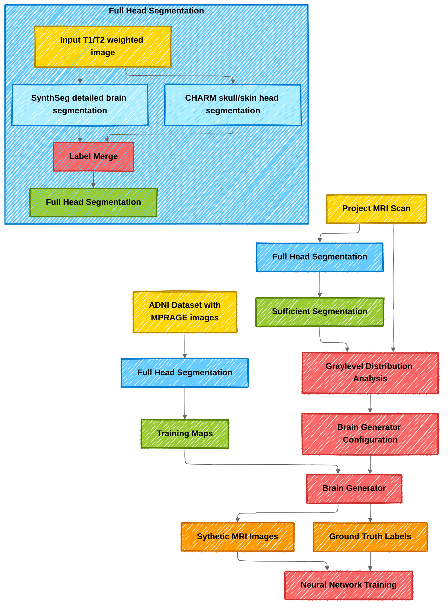

# BrainSegmentation

Project repository for tasks around brain segmentation.
The main goal of this project is to provide a consistent workflow for creating training datasets for neural network models.

The following workflow is an overview of the involved tasks:

